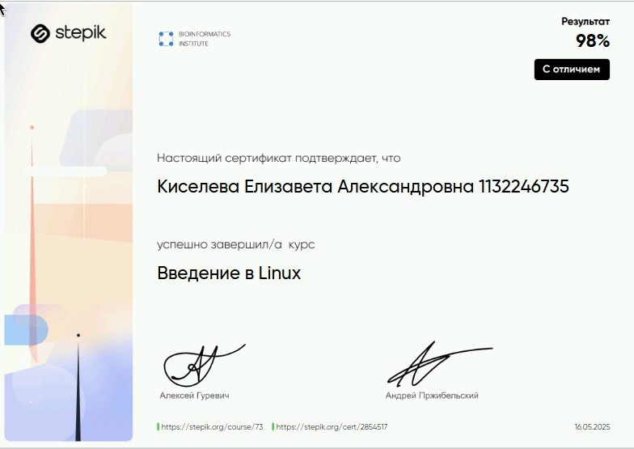

## О курсе

Курс [«Введение в Linux»](https://stepik.org/course/73/) на платформе Stepik охватывает как базовые, так и продвинутые темы работы в операционной системе Linux. Основное внимание уделяется работе в командной строке, взаимодействию с сервером и написанию скриптов на bash.

---

## Структура курса

### 1. Введение

- **1.1 Общая информация о курсе** — структура, цели, форматы.
- **1.2 Как установить Linux** — варианты установки дистрибутивов.
- **1.3 Осваиваем Linux** — базовые принципы работы.
- **1.4 Terminal: основы** — команды `pwd`, `ls`, `cd`, `man`.
- **1.5 Запуск исполняемых файлов**
- **1.6 Ввод / вывод** — перенаправление, каналы (`>`, `>>`, `|`).
- **1.7 Скачивание файлов из интернета** — `wget`, `curl`.
- **1.8 Работа с архивами** — `tar`, `gzip`, `bzip2`.
- **1.9 Поиск файлов и слов** — `find`, `grep`.

### 2. Работа на сервере

- **2.1 Знакомство с сервером** — SSH, подключение.
- **2.2 Обмен файлами** — `scp`, `rsync`.
- **2.3 Запуск приложений** — фоновые процессы.
- **2.4 Контроль программ** — `top`, `htop`, `kill`, `nice`.
- **2.5 Многопоточность** — команды и потоки.
- **2.6 Менеджер терминалов tmux** — сессии, окна, разделение.
- **2.7 Расширенное руководство по установке Linux**

### 3. Продвинутые темы

- **3.1 Текстовый редактор vim** — навигация, режимы, команды.
- **3.2 Bash-скрипты: основы** — переменные, выполнение команд.
- **3.3 Bash: условия и циклы** — `if`, `for`, `while`.
- **3.4 Bash: продвинутые скрипты** — аргументы, функции.
- **3.5 Продвинутый поиск и редактирование** — `sed`, `awk`.
- **3.6 Визуализация данных в gnuplot**
- **3.7 Разное** — дополнительные темы и лайфхаки.

---

## Мой опыт и результаты

📌 За время прохождения курса я:

- Освоила работу в терминале и на сервере.
- Научилась писать bash-скрипты разного уровня сложности.
- Уверенно использую команды для поиска, редактирования и автоматизации.
- Освоила работу с редактором **vim**, а также построение графиков в **gnuplot**.
- Получила сертификат и подготовила видеозапись с прохождением.

---

## Материалы проекта

- 🏆 **Сертификат** — PDF или изображение.
- 🎞 **Видео** — демонстрация моего прохождения курса.

---

## Скриншот сертификата

---

## Заключение

Это был мой не первый серьёзный опыт взаимодействия с Linux. Курс дал мне не только теоретические знания, но и практические навыки, которые я уже начала применять в учебных проектах. Он стал отличной базой для дальнейшего освоения DevOps и системного администрирования.

🚀 *Рекомендую курс всем студентам и тем, кто хочет работать с Linux-платформами.*
